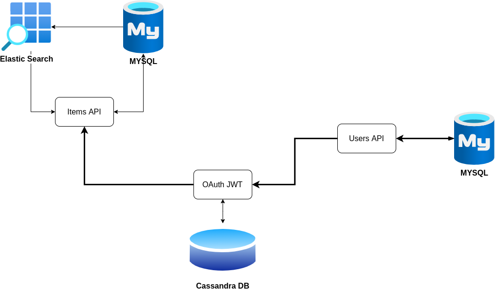

# BookStore Microservice API

Here is an example of a microservice API based on a clean architecture and SOLID principles implemented.

## Technology and Modules

- MySQL for data store
- Cassandra for store OAuth data
- Docker for container
- Elasticsearch
- Gin